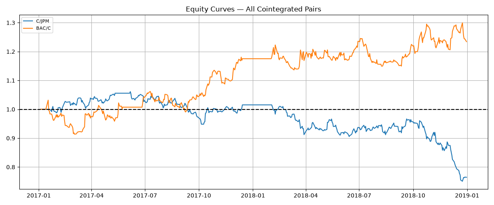
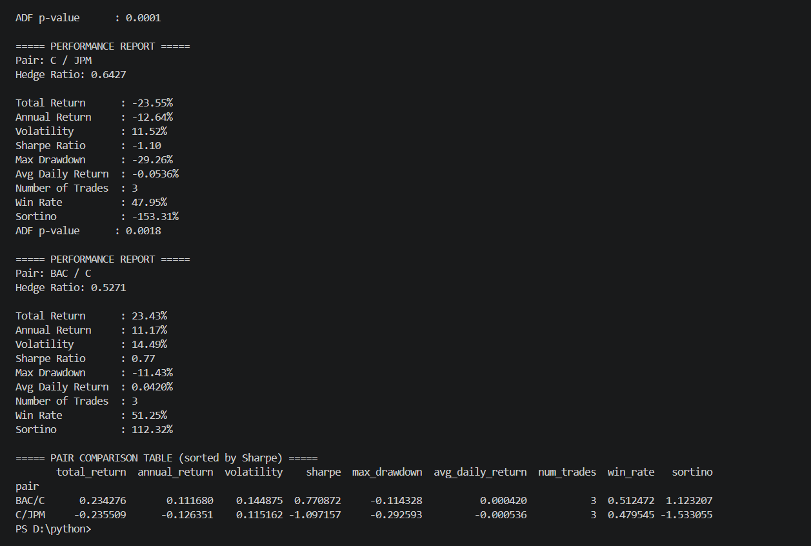

# Statistical Arbitrage Using Cointegration

A quantitative trading strategy that identifies cointegrated stock pairs, constructs market-neutral portfolios, and generates trading signals based on mean-reverting spread behavior.

## Overview

This project implements a classic pairs trading strategy using statistical arbitrage techniques. The workflow begins by selecting highly correlated stock pairs, testing them for cointegration, estimating hedge ratios through linear regression, and constructing a spread expected to exhibit mean-reverting behavior.

Trading signals are generated using the spread's z-score, with positions entered when the spread deviates significantly from its historical equilibrium and exited when it reverts.

The strategy is backtested on a universe of major global banking stocks and evaluated using common performance metrics such as annual return, Sharpe ratio, Sortino ratio, drawdown, and win rate.

---

## Strategy Pipeline

### 1. Data Collection

Historical daily closing prices are downloaded using Yahoo Finance.

**Universe**

* JPM
* BAC
* C
* WFC
* GS
* MS
* HSBC
* UBS
* SAN
* BBVA

Training Period:

* 2016

Testing Period:

* 2017–2018

---

### 2. Correlation Screening

Daily log returns are calculated for all stocks.

A correlation matrix is generated and only pairs with:

Correlation > 0.70

are retained for further analysis.

This reduces the search space and focuses on economically related securities.

---

### 3. Cointegration Testing

For each highly correlated pair, the Engle-Granger Cointegration Test is applied.

Pairs with:

p-value < 0.05

are considered cointegrated and eligible for trading.

Cointegration implies the existence of a long-term equilibrium relationship between two assets.

---

### 4. Hedge Ratio Estimation

For each cointegrated pair, an Ordinary Least Squares (OLS) regression is fitted:

Stock₁ = α + β × Stock₂

The coefficient β is used as the hedge ratio.

This creates a market-neutral spread:

Spread = Stock₁ − β × Stock₂

---

### 5. Mean Reversion Verification

An Augmented Dickey-Fuller (ADF) test is applied to the training spread.

A low ADF p-value indicates stationarity and supports the assumption of mean reversion.

---

### 6. Signal Generation

The spread is standardized using a z-score:

Z = (Spread − Mean) / Standard Deviation

Trading Rules:

**Long Spread**

* Enter when Z < -2

**Short Spread**

* Enter when Z > +2

**Exit Position**

* Exit when |Z| < 0.5

Positions are carried forward until an exit condition is met.

---

### 7. Portfolio Construction

For each signal:

Long Spread:

* Long Stock₁
* Short β × Stock₂

Short Spread:

* Short Stock₁
* Long β × Stock₂

This structure aims to isolate relative value opportunities while reducing market exposure.

---

### 8. Backtesting

Daily strategy returns are calculated using lagged positions to avoid look-ahead bias.

Performance is evaluated on out-of-sample test data.

---

## Performance Metrics

The following metrics are computed for every cointegrated pair:

* Total Return
* Annualized Return
* Annualized Volatility
* Sharpe Ratio
* Sortino Ratio
* Maximum Drawdown
* Average Daily Return
* Win Rate
* Number of Trades

A comparison table ranks all pairs by Sharpe Ratio.

---

## Visualization

The project automatically generates:

### Spread Chart

Shows spread behavior and trading thresholds.

### Z-Score Signals

Displays long and short entry points.

### Equity Curve

Tracks cumulative strategy performance over time.

### Multi-Pair Comparison

Overlays equity curves for all cointegrated pairs.

---
## Sample Results

### Equity Curve



### Pair Performance Comparison


## Example Output

```text
===== PERFORMANCE REPORT =====

Pair: JPM / BAC

Total Return      : 18.42%
Annual Return     : 8.97%
Volatility        : 6.12%
Sharpe Ratio      : 1.47
Max Drawdown      : -4.81%
Win Rate          : 56.30%
Number of Trades  : 14
```

---

## Technologies Used

* Python
* Pandas
* NumPy
* Matplotlib
* Statsmodels
* yFinance

---

## Future Improvements

Potential enhancements include:

* Rolling hedge ratio estimation
* Rolling z-score calculation
* Transaction cost modeling
* Half-life estimation of mean reversion
* Walk-forward optimization
* Kalman Filter dynamic hedge ratios
* Portfolio-level capital allocation
* Risk-adjusted position sizing

---

## Disclaimer

This project is intended for educational and research purposes only. Past performance does not guarantee future results. Trading financial markets involves substantial risk and may result in losses.

---

## Author

Kanisk Kumar

Quantitative Finance & Algorithmic Trading Enthusiast

Indian Institute of Technology (BHU), Varanasi
